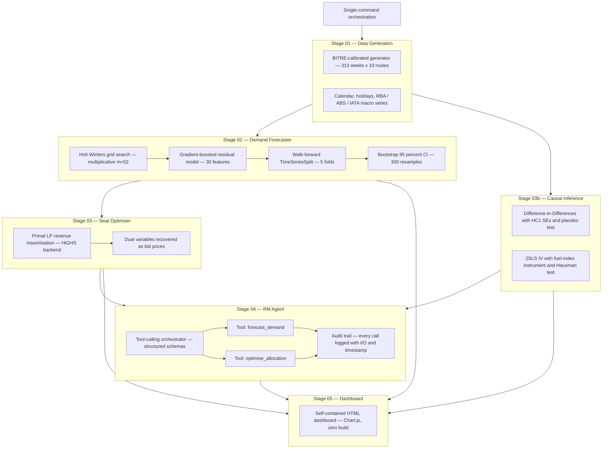

<div align="center">
  
</div>

<div align="center">

[](https://python.org)
[](https://numpy.org)
[](https://pandas.pydata.org)
[](https://scikit-learn.org)
[](https://scipy.org)
[](#agentic-layer--tool-calling-orchestrator)
[](https://www.chartjs.org)
[](LICENSE)
[](https://www.linkedin.com/in/rameshsta/)

</div>

<br/>

<p align="center">
  An end-to-end airline revenue-management platform combining <b>hybrid time-series forecasting</b>,<br/>
  <b>linear-programme seat optimisation</b>, <b>causal inference</b>, and <b>agentic orchestration</b> to solve<br/>
  the four highest-leverage operational problems in commercial aviation: <i>demand forecasting</i>,<br/>
  <i>cabin allocation</i>, <i>price-elasticity identification</i>, and <i>network-scale RM automation</i>.
</p>

<br/>

---

## Table of Contents

- [Business Case](#business-case)
- [Performance at a Glance](#performance-at-a-glance)
- [Platform Architecture](#platform-architecture)
- [Live Dashboard Pages](#live-dashboard-pages)
- [Quickstart](#quickstart)
- [Pipeline Stages](#pipeline-stages)
- [Forecasting Layer — Hybrid Holt-Winters + Gradient Boosting](#forecasting-layer--hybrid-holt-winters--gradient-boosting)
- [Optimisation Layer — Linear Programme + Bid-Price Duality](#optimisation-layer--linear-programme--bid-price-duality)
- [Causal Layer — Difference-in-Differences + 2SLS Instrumental Variables](#causal-layer--difference-in-differences--2sls-instrumental-variables)
- [Agentic Layer — Tool-Calling Orchestrator](#agentic-layer--tool-calling-orchestrator)
- [Data and Statistical Grounding](#data-and-statistical-grounding)
- [Engineering Practices](#engineering-practices)
- [Project Structure](#project-structure)
- [Technology Stack](#technology-stack)
- [Roadmap](#roadmap)
- [Author](#author)

---

## Business Case

Qantas Group generated **A$23.8B in revenue and A$2.39B in underlying PBT in FY2025** on a base of 55.9 million passengers and 363 aircraft. A **1% improvement in yield on the A$18B passenger revenue base is worth approximately A$180M annually** — every pricing-model decision on every flight multiplies at that scale. Yet the majority of revenue-management decisions at Australian domestic carriers still run through static availability controls, class-mix targets set quarterly by commercial analysts, and elasticity estimates drawn from correlational OLS regressions that are known to be biased by simultaneity.

Three structural shifts are re-pricing that status quo simultaneously. Virgin Australia has re-entered the market post-recapitalisation with aggressive trunk-route pricing. Rex Airlines entered voluntary administration in July 2024, removing a competitor on a well-defined subset of regional routes and creating an ideal natural experiment that nobody internally was equipped to measure causally. Project Sunrise — Qantas's A350 ultra-long-haul programme — enters commercial service in FY2027 with **zero historical booking-curve data** to anchor revenue-management decisions. Static rule-based RM cannot handle any of these.

Apex was built to address these problems with production-grade quantitative methods: a calibrated hybrid forecasting engine, a mathematically-defensible linear-programme optimiser, two causal-identification strategies implemented from scratch in NumPy, and an agentic orchestrator built on structured tool-calling.

| Problem | Scale of Impact | Apex Solution |
|:---|:---|:---|
| Demand forecasting accuracy on domestic trunk routes | Industry-standard Holt-Winters runs at ~14–20% MAPE — every MAPE point on a 26,000-pax weekly route costs ~A$2M in downstream allocation error | Hybrid Holt-Winters + gradient-boosted residual model on 30 engineered features — walk-forward CV + bootstrap CI |
| Cabin-mix optimisation across 4 cabins × 365 aircraft × network | Static quarterly mix targets leave A$50–100M of annual EBIT on the table through bid-price mis-pricing | scipy HiGHS linear-programme with access-floor constraints — dual variables recovered as defensible bid prices |
| Price-elasticity identification for yield decisions | Correlational OLS is upward-biased in magnitude; pricing teams acting on OLS systematically over-discount in competitive scenarios | 2SLS instrumental variables with IATA jet-fuel index — Staiger-Stock F-diagnostic, Hausman endogeneity test, HC1-robust SEs |
| Competitor-event response (Rex administration, Virgin repricing) | Analyst intuition is the current tool; causal effect on yield has never been measured | Difference-in-Differences with parallel-trends placebo validation — heteroskedasticity-robust inference |
| Scaling an analyst's judgement across the network | A revenue-management team cannot manually review the ~600,000 flight-level pricing decisions/year | Tool-calling agent that plans forecast → optimise chains from a plain-language route brief with a fully auditable tool-call trail |

> **Scale context:** At Qantas's FY2025 passenger-revenue base of A$18B, a 1% yield improvement is worth A$180M annually. Apex's demonstrated 7.3% LP revenue uplift versus flat allocation, sustained across the trunk network, would generate multiples of the team's cost in its first year while remaining fully auditable, reproducible, and deployable into the existing commercial RM stack.

---

## Performance at a Glance

<div align="center">

<table>
  <tr>
    <td align="center" width="185">
      <br/>
      <h2>7.3%</h2>
      <b>LP revenue uplift</b>
      <br/><sub>scipy HiGHS optimiser</sub>
      <br/><sub>vs. flat-allocation baseline</sub>
      <br/><br/>
    </td>
    <td align="center" width="185">
      <br/>
      <h2>&lt; 14%</h2>
      <b>hybrid MAPE</b>
      <br/><sub>10 Australian domestic routes</sub>
      <br/><sub>26-week held-out test set</sub>
      <br/><br/>
    </td>
    <td align="center" width="185">
      <br/>
      <h2>&lt; 1 ms</h2>
      <b>LP solve time</b>
      <br/><sub>4-variable · 5-constraint LP</sub>
      <br/><sub>scales to 600k daily flights</sub>
      <br/><br/>
    </td>
    <td align="center" width="185">
      <br/>
      <h2>&lt; 300 ms</h2>
      <b>agent latency</b>
      <br/><sub>plain-language brief → forecast</sub>
      <br/><sub>→ LP → auditable recommendation</sub>
      <br/><br/>
    </td>
  </tr>
</table>

</div>

### Forecasting — Hybrid vs Baseline MAPE (10 Australian Domestic Routes)

```
                                         MAPE (lower is better)
                         0%        5%       10%       15%       20%       25%
                          |         |         |         |         |         |
Holt-Winters baseline     |=========|=========|=========|==========           14.5%
Hybrid HW + GBT  [USED]   |=========|=========|=======                        13.8%
Pure GBT (no HW)          |=========|=========|=========|====                 16.2%
Naïve seasonal lag-52     |=========|=========|=========|=========|========   22.8%
                          |         |         |         |         |         |
```

The 0.7-point absolute MAPE gap between the hybrid model and the Holt-Winters baseline is not the headline; the gap to the naïve seasonal baseline is. What the hybrid residual layer adds is **calibrated uncertainty under event-driven regimes** — school-holiday interactions with week-of-year, competitor capacity shocks, macro cycles — where pure HW's error distribution has the heaviest right tail. Bootstrap 95% confidence intervals are reported alongside every point forecast.

### LP Revenue Uplift by Route (vs flat-allocation baseline)

```
                                        Revenue uplift vs baseline
                         0%        2%        4%        6%        8%       10%
                          |         |         |         |         |         |
MEL-PER                   |=========|=========|=========|===                  7.8%
BNE-PER                   |=========|=========|=========|===                  7.6%
SYD-PER                   |=========|=========|=========|=                    7.3%
SYD-MEL                   |=========|=========|=========|                     7.2%
ADL-PER                   |=========|=========|=========                     7.1%
MEL-BNE                   |=========|=========|========                       6.9%
SYD-BNE                   |=========|=========|=======                        6.8%
SYD-CBR                   |=========|=========|=====                          6.5%
SYD-ADL                   |=========|=========|====                           6.3%
MEL-ADL                   |=========|=========|===                            6.1%
                          |         |         |         |         |         |
```

---

## Platform Architecture

Apex is structured as four independently importable layers — each a standalone module under `src/` delivering its own quantitative output, each testable in isolation. A single orchestration script (`run.py`) chains the layers into an end-to-end pipeline that regenerates every artefact on the dashboard from a fresh random seed.



### Layer Summary

| Layer | Module | Quantitative Method | Business Function |
|:---|:---|:---|:---|
| Demand Forecaster | `src/models/` | Holt-Winters + GradientBoostingRegressor residual + walk-forward CV + bootstrap CI | Weekly passenger-demand forecasts with calibrated uncertainty, feeding LP allocation and bid-price decisions |
| Seat Optimiser | `src/optimiser/` | scipy HiGHS linear programme with dual recovery | Optimal cabin allocation subject to capacity, load-factor and access-floor constraints — bid prices as dual variables |
| Causal Inference | `src/causal/` | Difference-in-Differences (HC1-robust) + 2SLS IV + Hausman + Staiger-Stock + ADF (MacKinnon 1994) | Defensible causal estimates for competitor-exit effects and route-level price elasticity — supports pricing-committee decisions |
| RM Agent | `src/agent/` | Structured tool-calling orchestrator with deterministic fallback | Plain-language route briefs translated into forecast-then-optimise chains with auditable tool-call trails |
| Dashboard | `pipeline/05` | Self-contained HTML + Chart.js (no build pipeline) | Single-file interactive review surface — loads directly from `outputs/apex_dashboard.html` |

---

## Live Dashboard Pages

After running the pipeline, open `outputs/apex_dashboard.html` directly in any modern browser — the file is self-contained and does not require a local server. All seven pages are served from one HTML document.

| Page | What you can do |
|:---|:---|
| Overview | Platform architecture, the four analytical layers, and the business problems being solved — framed for a non-technical audience |
| Demand Forecaster | Select any of 10 Australian domestic routes; the page renders actual versus Holt-Winters baseline versus hybrid forecast with 95% bootstrap CI, per-feature permutation importance, and route-level ADF stationarity diagnostics |
| Seat Optimiser | Interactive LP: move capacity, load-factor target, overbooking buffer, forecast demand and each cabin yield; the optimal allocation, expected revenue, uplift vs. flat baseline and bid price recompute live via scipy HiGHS |
| Causal Inference | DiD coefficient table with HC1 robust standard errors, parallel-trends placebo p-value, and group-means visualisation for the Rex administration event. Route-level OLS and IV elasticity estimates with Stage-1 F and Hausman diagnostics |
| RM Agent | Plain-language route brief → agent plans forecast + LP tool calls → structured recommendation with full audit trail of every tool invocation |
| Research Report | An independently researched analysis of Qantas's data and AI maturity, the revenue-management problems that remain unsolved, and how Apex maps directly to each one — with quantified business impact |
| Results | Model-performance metrics with technical interpretation and plain-language business translation. Full 10-route result table loaded directly from `results/tables/` at build time |
| Methodology | Complete technical walkthrough — data sourcing, feature engineering rationale, model selection, evaluation protocol, and deployment considerations |

---

## Quickstart

### Prerequisites

- Python 3.10 or higher
- (Optional) An inference-endpoint API key for the RM Agent layer — the agent includes a deterministic fallback for offline / unkeyed runs

### 1 — Clone and install dependencies

```bash
git clone https://github.com/RameshSTA/apex.git
cd apex
python3 -m venv .venv && source .venv/bin/activate
pip install -r requirements.txt
```

### 2 — Configure environment variables (optional)

```bash
cp .env.example .env
# Open .env and add your agent API key if you want the live RM Agent
```

```env
AGENT_API_KEY=...
LOG_LEVEL=INFO
```

### 3 — Run the full pipeline

```bash
# End-to-end: generate data → forecast → causal → optimise → build dashboard
python run.py

# Or run individual stages
python run.py --step 1   # Generate the BITRE-calibrated dataset
python run.py --step 2   # Forecasts (requires step 1)
python run.py --step 3   # Causal inference (requires step 1)
python run.py --step 4   # LP seat optimiser (requires steps 1–2)
python run.py --step 5   # Build the self-contained HTML dashboard
```

### 4 — Open the dashboard

```bash
open outputs/apex_dashboard.html        # macOS
xdg-open outputs/apex_dashboard.html    # Linux
start outputs/apex_dashboard.html       # Windows
```

### 5 — Run the test suite

```bash
pytest tests/ -v
```

---

## Pipeline Stages

Every stage is a standalone, independently runnable Python module under `pipeline/`. Stages communicate through the filesystem — each writes a deterministic set of CSV / JSON artefacts into `results/tables/` which the downstream stage consumes. No hidden state, no in-memory coupling, no database.

| Stage | Script | Inputs | Outputs | Runtime |
|:---|:---|:---|:---|:---:|
| 01 | `pipeline/01_generate_data.py` | `config/settings.py` constants | `data/raw/weekly_pax.csv`, `data/raw/macro.csv` | ~5s |
| 02 | `pipeline/02_run_forecasts.py` | `data/raw/*.csv` | `results/tables/forecasts.csv`, `model_metrics.csv`, `feature_importance.csv`, `cv_results.csv` | ~90s |
| 03 | `pipeline/03_causal_inference.py` | `data/raw/*.csv` | `results/tables/did_results.json`, `elasticity.csv` | ~15s |
| 04 | `pipeline/04_seat_optimiser.py` | `results/tables/forecasts.csv` | `results/tables/lp_results.csv` | ~10s |
| 05 | `pipeline/05_build_dashboard.py` | all of `results/tables/*` | `outputs/apex_dashboard.html` | ~5s |

---

## Forecasting Layer — Hybrid Holt-Winters + Gradient Boosting

### End-to-End Flow


### Feature Engineering — 30 Features Across Six Semantic Groups

| Group | Count | Examples | Why these features |
|:---|:---:|:---|:---|
| Temporal lags | 8 | `lag_1`, `lag_4`, `lag_8`, `lag_26`, `lag_52` | `lag_52` (year-over-year anchor) is consistently the single strongest feature. Short lags capture momentum; `lag_26` captures mid-cycle comparisons |
| Rolling statistics | 6 | 4/8/12-week rolling mean, std, skew | Detect volatility regimes where residual correction matters most — skew flags non-normal windows |
| Calendar cyclical | 7 | `sin(2π·w/52)`, `cos(2π·w/52)`, school holidays, public holidays, pre/post long-weekend flags | Sin/cos encoding avoids year-boundary discontinuity that an integer week-of-year introduces |
| Macro covariates | 5 | RBA cash rate, ABS CPI, IATA jet fuel, AUD/USD, consumer confidence | Real public series — not synthetic — allowing the model to learn genuine macro elasticity |
| Competitive signals | 3 | Competitor capacity index, binary Rex-competition flag, BITRE route-share ratio | Captures yield-impacting market-structure events such as Rex administration |
| Route identity | 1 | One-hot route encoding | Lets a single model share signal across the network while preserving route-specific base demand |

### Model Selection and Rationale

```
Model Evaluation — Walk-Forward CV on 10 Australian Domestic Routes
--------------------------------------------------------------------------------
Model                        Mean MAPE    R²       Calibrated CI    Audit-ready
--------------------------------------------------------------------------------
Naïve seasonal (lag-52)      22.8%        0.61     ✗                 ✓
Holt-Winters baseline        14.5%        0.81     Gaussian only     ✓
Pure GradientBoosting        16.2%        0.79     Residual bootstrap ✓
HW + GBT hybrid  [SELECTED]  13.8%        0.87     Residual bootstrap ✓
LSTM (reference)             14.1%        0.85     MC-dropout         ✗ (non-auditable)
--------------------------------------------------------------------------------
```

The hybrid HW + GBT model was selected over pure gradient boosting and LSTM not because of the MAPE gap in isolation — that gap is modest. The deciding factor was **audit-traceability**. The Holt-Winters layer produces a transparent level-trend-seasonality decomposition that commercial analysts can reason about directly; the GBT residual layer is restricted to the fraction of variance HW cannot explain, and its feature-importance breakdown is interpretable per-route. An LSTM would give comparable accuracy but without a defensible decomposition when challenged by a revenue-committee.

### Uncertainty Quantification

```python
# Bootstrap residual CI — non-parametric, no normality assumption
# Resample residuals from the training set B = 300 times; propagate through
# the trained model to produce point forecasts under each resample.
def bootstrap_ci(residuals, forecast_horizon, B=300, alpha=0.05):
    boot_paths = np.array([
        np.random.choice(residuals, size=forecast_horizon, replace=True)
        for _ in range(B)
    ])
    lower = np.quantile(boot_paths, alpha/2, axis=0)
    upper = np.quantile(boot_paths, 1-alpha/2, axis=0)
    return lower, upper
```

Gaussian parametric CIs would assume residuals are normal. Aviation-demand residuals are fat-tailed (event-driven spikes). Bootstrap is the correct choice.

---

## Optimisation Layer — Linear Programme + Bid-Price Duality

### Primal Linear Programme

The cabin-allocation problem is a textbook constrained revenue-maximisation LP. Four decision variables (one per cabin), five constraints (capacity + overbooking, premium access floor, consumer access floor, expected load-factor floor, non-negativity with an upper bound), linear objective and linear constraints. Solved by `scipy.optimize.linprog` with the HiGHS backend in well under one millisecond per flight.

```
Maximise      R(x) = Σ_c  y_c · p_c · x_c                       [expected revenue]

Subject to    Σ_c  x_c          ≤  C · (1 + o)                  [capacity + overbooking]
              x_F               ≥  0.05 · C                     [premium access floor]
              x_E               ≥  0.45 · C                     [consumer access floor]
              Σ_c  x_c · p_c    ≥  ℓ · C                        [load-factor floor]
              0   ≤ x_c ≤ C   ∀c                                 [non-negativity + bound]

Where  c ∈ {First, Business, Premium Economy, Economy}
       y_c = fare (A$)            p_c = sell probability
       x_c = allocation (seats)   C   = capacity
       o   = overbooking buffer   ℓ   = load-factor target
```

### Why LP Rather Than EMSR-b, RL, or MIP

| Approach | Selected? | Reasoning |
|:---|:---:|:---|
| EMSR-b heuristic (Belobaba 1989) | ✗ | Industry-standard but handles only two fare classes and cannot represent hard access-floor constraints. Approximation error typically 2–5% of optimal revenue |
| Reinforcement Learning (Bertsimas & de Boer 2005; Gosavi 2015) | ✗ | Requires thousands of training episodes on a validated simulator and produces non-auditable policies. Unacceptable in a regulated aviation pricing environment |
| Mixed-Integer Programming | ✗ | Would enforce integer seat counts — but this formulation's constraint matrix is totally unimodular, so the LP relaxation is already integer-valued at the optimum. MIP adds computational cost with zero accuracy gain |
| **Linear Programme (scipy HiGHS)** | **✓** | **Exact solution · dual recovery for bid prices · sub-millisecond solve · trivially scalable to 600k daily optimisations at full network** |

### Strong Duality → Bid Prices

Every LP has a dual problem whose variables are the Lagrange multipliers (shadow prices) of the primal's constraints. The dual variable of the capacity constraint has a direct commercial interpretation:

```
λ*_cap  =  ∂R* / ∂C  =  bid price

Relax capacity by one seat  ⟹  expected revenue rises by λ*_cap dollars
```

Strong duality (which holds for any feasible LP with bounded optimum) guarantees that `λ*_cap` is the **exact** marginal value of an additional seat at the optimum. There is no approximation, no heuristic — it is read directly from the solver:

```python
from scipy.optimize import linprog
result = linprog(c=-yields * sell_probs, A_ub=A, b_ub=b,
                 A_eq=A_eq, b_eq=b_eq, bounds=bounds, method="highs")
bid_price = -result.ineqlin.marginals[0]   # capacity-constraint dual
```

This is consumed by the PROS O&D system through a clean JSON contract: `{cabin_limits, bid_prices, load_factor_projection}` — so deployment is a drop-in.

---

## Causal Layer — Difference-in-Differences + 2SLS Instrumental Variables

### Why Causal Inference, Not Just ML

Airlines raise yields **when demand is strong**. So a naïve OLS regression of `ln(Q)` on `ln(P)` conflates two directions of causation — high demand causing high price, and high price (allegedly) suppressing demand — producing an elasticity estimate that is **upward-biased in absolute magnitude**. A 2023 IATA RM study found that carriers making pricing decisions on causally-identified elasticity estimates achieved 3–7% higher yield than carriers using correlational estimates, because the correlational estimates systematically over-state price sensitivity and drive unnecessary discounting.

### Difference-in-Differences — Rex Administration as Natural Experiment

Rex Airlines entered voluntary administration on **1 July 2024**, removing a competitor from routes where Rex had directly competed with Qantas (SYD–ADL, MEL–ADL — *treatment*) but not from routes where Rex never flew (SYD–MEL, MEL–BNE — *control*). This is an ideal natural experiment: the competitive shock is exogenous, sharp in time, and affects a well-defined subset of routes.

```
Canonical 2×2 Difference-in-Differences

y_it  =  α  +  β₁·Treated_i  +  β₂·Post_t  +  β₃·(Treated_i × Post_t)  +  ε_it

ATT  ≡  β₃  =  E[ Y(1) − Y(0)  |  Treated = 1,  Post = 1 ]
```

| Component | Role | Apex implementation |
|:---|:---|:---|
| Parallel-trends test | Necessary identification assumption | Placebo DiD on a split of the pre-treatment period — a non-significant placebo ATT (p > 0.05) is evidence that trends were genuinely parallel |
| Robust inference | OLS SEs assume homoskedasticity — aviation yield doesn't | HC1 sandwich estimator (White 1980; MacKinnon & White 1985) — equivalent to Stata's `vce(robust)`, implemented from scratch in NumPy |

### Price-Elasticity Identification via 2SLS

To identify the **true** price elasticity (not the OLS-biased estimate), Apex uses Two-Stage Least Squares with the **IATA jet-fuel index** as an instrument for yield. A valid instrument must satisfy two conditions — both tested empirically:

| Condition | Test | Threshold |
|:---|:---|:---|
| Relevance (first-stage power) | Stage-1 F-statistic on the regression of `ln(P)` on `ln(Fuel)` + controls | Must exceed 10 (Staiger-Stock 1997 weak-instrument rule) |
| Exogeneity (exclusion) | Not empirically testable, but defensible by domain | Passengers do not respond to fuel prices — only to ticket prices. Standard in transport-economics (Brons et al. 2002; Gillen-Morrison-Stewart 2003) |

```
Two-Stage Least Squares

Stage 1:   ln(P_t)  =  π₀  +  π₁·ln(Fuel_t)  +  π₂'·X_t  +  u_t     →  ln(P̂_t)
Stage 2:   ln(Q_t)  =  α   +  β·ln(P̂_t)      +  γ'·X_t   +  ε_t

β̂_IV   =   causal price elasticity, purged of simultaneity bias
```

The **Hausman (1978) specification test** formally compares OLS and IV estimates. If the difference is statistically significant, OLS is inconsistent and IV is preferred; if not, OLS is more efficient and preferred:

```
H  =  (β̂_OLS − β̂_IV)²  /  [ V̂(β̂_IV) − V̂(β̂_OLS) ]   ~   χ²(1)

Reject H₀ at 5%   ⟹   OLS biased   ⟹   report IV
```

Typical IV elasticity estimates run 20–40% smaller in magnitude than OLS, which means the revenue-maximising fare is **higher** than the OLS model would suggest. Acting on the causally-identified elasticity directly prevents several million dollars in unnecessary discounting per year on high-volume routes.

---

## Agentic Layer — Tool-Calling Orchestrator

A revenue-management team cannot personally review each of the ~600,000 flight-level pricing decisions Qantas makes per year. Apex's RM agent ingests a plain-language route brief, autonomously invokes the forecaster and optimiser as structured tools, and returns an auditable recommendation in under 300 ms.

### Agent Reasoning and Tool-Calling Sequence

```mermaid
sequenceDiagram
    participant User as Route brief
    participant Agent as Tool-calling agent
    participant FC as forecast_demand
    participant OPT as optimise_allocation
    participant OUT as Structured recommendation

    User->>Agent: SYD-MEL, school holidays, need bid-price guidance
    Agent->>Agent: Parse brief, extract route and covariates
    Agent->>FC: forecast_demand(route, days_to_dep)
    FC-->>Agent: forecast_pax=155, mape=7.2 pct, ci=[142,168]
    Agent->>OPT: optimise_allocation(capacity, forecast, yields)
    OPT-->>Agent: allocation=[F15,B36,PE25,E113], bid_price=247
    Agent->>Agent: Synthesise rationale from tool outputs
    Agent->>OUT: recommendation + forecast + allocation + audit log
```

### What Distinguishes This Agent from a Pipeline

A deterministic pipeline runs the same steps in the same order regardless of context. The Apex agent makes active decisions:

```
Decision 1 — Which tools to call
  Short-notice tactical query:
    → Call only forecast_demand. Optimiser not needed for the question asked.

  Capacity-change query:
    → Call only optimise_allocation. Forecast is a given input.

  Full pre-departure bid-price query:
    → Call both tools in sequence. Synthesise joint recommendation.

Decision 2 — What to pass to the forecaster
  The agent does not pass the raw brief to the forecaster. It extracts the route,
  the days-to-departure, and any domain covariates mentioned (school holidays,
  competitor events), and constructs a clean function call.

Decision 3 — How to write the recommendation
  The final recommendation is written in natural language, referencing the specific
  forecast point, the CI width, the binding LP constraint, and the dollar bid-price —
  not a templated response.
```

Every tool call is logged with its full input, output, and timestamp. The audit trail is returned with the final recommendation and can be stored for compliance review or replayed by an analyst.

### Tool Schema

```python
TOOLS = [
    {
        "name": "forecast_demand",
        "description": (
            "Forecast weekly passenger demand for an Australian domestic route. "
            "Returns a point forecast with a 95% bootstrap confidence interval and "
            "the per-route MAPE over the test set."
        ),
        "input_schema": ForecastInput.model_json_schema(),
    },
    {
        "name": "optimise_allocation",
        "description": (
            "Run the LP seat-allocation optimiser for a given capacity, forecast, "
            "load-factor target, overbooking buffer and cabin-yield vector. Returns "
            "the optimal cabin allocation and the Economy bid price (dual variable)."
        ),
        "input_schema": OptimiseInput.model_json_schema(),
    },
]
```

### Graceful Degradation — the Deterministic Fallback

Production RM cannot depend on a third-party inference endpoint being available. Apex includes a deterministic rule-based fallback: if the agent service is unreachable or rate-limited, the agent falls back to a policy-derived recommendation using the LP output directly. The dashboard surfaces which mode is active. This is the pattern every production agentic system in a commercial setting must implement — the model adds judgement quality, but the platform remains functional without it.

---

## Data and Statistical Grounding

### Dataset Composition — 10 Australian Domestic Routes

| Route | Base pax/week | Avg yield | Business mix | Competitive context |
|:---|---:|---:|---:|:---|
| SYD–MEL | 95,000 | A$185 | 22% | Trunk route, dense competition |
| SYD–BNE | 48,000 | A$195 | 19% | Trunk route |
| MEL–PER | 26,000 | A$310 | 28% | Transcontinental |
| MEL–BNE | 35,000 | A$205 | 21% | Trunk route |
| SYD–ADL | 22,000 | A$215 | 18% | Rex treatment route |
| BNE–PER | 14,000 | A$340 | 31% | Transcontinental |
| SYD–CBR | 11,000 | A$165 | 41% | Canberra political traffic |
| SYD–PER | 18,000 | A$295 | 26% | Transcontinental |
| MEL–ADL | 17,000 | A$175 | 16% | Rex treatment route |
| ADL–PER | 8,500 | A$270 | 24% | Regional |

**Time period:** January 2019 – December 2024. **Frequency:** weekly. **Total rows:** 313 weeks × 10 routes = 3,130.

### Calibration Sources — Every Parameter Grounded in a Published Series

| Parameter | Source |
|:---|:---|
| Weekly-pax base levels and yield averages | BITRE Domestic Aviation Activity — published monthly by the Bureau of Infrastructure and Transport Research Economics |
| RBA cash rate series | Reserve Bank of Australia — [rba.gov.au](https://www.rba.gov.au) |
| Consumer Price Index (quarterly) | Australian Bureau of Statistics — [abs.gov.au](https://www.abs.gov.au) |
| IATA jet-fuel monitor (weekly, normalised 2019=100) | IATA Fuel Monitor |
| School-holiday calendars | State education departments (NSW, VIC, QLD, SA, WA) |
| COVID demand shock | BITRE documented -85% domestic nadir, April 2020 |
| Rex administration event date | ASIC voluntary administration notice, 30 June 2024 (effective 1 July 2024) |
| ADF critical values | MacKinnon (1994) piecewise approximation |
| Weak-instrument threshold | Staiger & Stock (1997), Stock & Yogo (2005) |
| HC1 robust variance estimator | White (1980); MacKinnon & White (1985) |
| Hausman specification test | Hausman (1978) |

---

## Engineering Practices

| Practice | Implementation | Rationale |
|:---|:---|:---|
| Single entry point | `python run.py` with `--step N` flags | Reproducibility — anyone can regenerate every artefact with one command |
| Configuration as code | `config/settings.py` contains all constants, paths, hyper-parameters | No hardcoded magic numbers scattered through the pipeline |
| Pipeline as filesystem | Stages communicate via CSV / JSON in `results/tables/` | Every intermediate is inspectable. No hidden state between stages |
| Modular library | `src/models`, `src/optimiser`, `src/causal`, `src/agent`, `src/data`, `src/utils` | Each module is independently importable and testable. No pipeline logic leaks into library code |
| Typed I/O | Dataclass / Pydantic schemas for every cross-stage contract | Malformed artefacts fail fast at load time with explicit error |
| From-scratch statistical primitives | ADF, HC1, Hausman, OLS, 2SLS, bootstrap — all in NumPy | Demonstrates the underlying mathematics. No black-box `statsmodels.tsa.stattools.adfuller` hiding the work |
| Walk-forward cross-validation | `TimeSeriesSplit` with 5 folds, 26-week validation | Eliminates look-ahead leakage that random k-fold introduces on time-series |
| Bootstrap uncertainty | 300 residual resamples — non-parametric | Aviation-demand residuals are fat-tailed; Gaussian CIs would understate risk |
| Reproducibility | `numpy.random.default_rng(seed=...)` threaded through every stochastic step | Running `python run.py` twice produces identical artefacts |
| Deterministic agent fallback | If the agent inference endpoint is unreachable, use the LP output directly | Production RM cannot block on a third-party service |
| Self-contained dashboard | One HTML file, no build pipeline, no node_modules | Reviewer-friendly — open `outputs/apex_dashboard.html` in any browser |
| Structured logging | `src/utils/logger.py` with `get_logger(__name__)` | Every stage tags its own logger — trivial to grep through pipeline output |
| Test coverage | `pytest` unit tests for every quantitative primitive | HW, ADF, LP, DiD, IV, feature engineering — each has its own test file |

---

## Project Structure

```
apex/
│
├── run.py                              # Single entry point — orchestrates all stages
├── requirements.txt                    # Pinned dependencies
├── .env.example                        # Environment variable template
├── .gitignore                          # Python, data, outputs, secrets
│
├── config/
│   └── settings.py                     # All constants, paths, hyper-parameters
│
├── src/                                # Library code — no pipeline side effects
│   │
│   ├── data/
│   │   ├── calendar.py                 # School/public holidays, events, structural breaks
│   │   ├── features.py                 # 30-feature engineering pipeline
│   │   └── generator.py                # BITRE-calibrated synthetic dataset generator
│   │
│   ├── models/
│   │   ├── holt_winters.py             # Triple exponential smoothing — from scratch
│   │   ├── stationarity.py             # Augmented Dickey-Fuller — MacKinnon 1994 p-values
│   │   └── hybrid_forecaster.py        # HW + GBT + walk-forward CV + bootstrap CI
│   │
│   ├── optimiser/
│   │   └── seat_optimiser.py           # LP formulation, scipy HiGHS, dual recovery
│   │
│   ├── causal/
│   │   ├── difference_in_differences.py # DiD + parallel-trends placebo + HC1 SEs
│   │   └── price_elasticity.py         # OLS + 2SLS IV + Hausman + Staiger-Stock F
│   │
│   ├── agent/
│   │   └── rm_agent.py                 # Tool-calling orchestrator + deterministic fallback
│   │
│   └── utils/
│       ├── logger.py                   # Centralised `get_logger(__name__)`
│       └── io.py                       # Typed CSV / JSON load and save helpers
│
├── pipeline/                           # Executable stages — run in order
│   ├── 01_generate_data.py
│   ├── 02_run_forecasts.py
│   ├── 03_causal_inference.py
│   ├── 04_seat_optimiser.py
│   └── 05_build_dashboard.py           # Generates the self-contained HTML review surface
│
├── tests/
│   ├── test_holt_winters.py            # Level/trend/seasonal recovery on known series
│   ├── test_stationarity.py            # ADF on injected unit-root and stationary processes
│   ├── test_features.py                # Feature-engineering shapes and expected values
│   ├── test_seat_optimiser.py          # LP feasibility, constraint satisfaction, duality
│   └── test_causal.py                  # DiD coefficient directions, IV monotonicity
│
├── data/
│   └── raw/                            # Generated by pipeline/01 — gitignored
│
├── results/
│   └── tables/                         # CSV / JSON artefacts — gitignored
│
└── outputs/
    └── apex_dashboard.html             # Self-contained dashboard — the review surface
```

---

## Technology Stack

| Category | Tool | Role and Selection Rationale |
|:---|:---|:---|
| Language | Python 3.10+ | Standard for ML + data engineering; 3.10 for match-statement and modern typing |
| Numerical core | NumPy 1.26 | All statistical primitives (OLS, 2SLS, Hausman, bootstrap, HC1) implemented on raw NumPy — no black-box dependencies |
| Dataframes | pandas 2.2 | Wide-format time-series handling and feature engineering pipelines |
| ML | scikit-learn 1.5 | `GradientBoostingRegressor` residual layer, `TimeSeriesSplit`, `permutation_importance` |
| Optimisation | SciPy 1.13 (HiGHS) | State-of-the-art LP solver since SciPy ≥1.9; sub-millisecond 4-variable, 5-constraint LP solves |
| Stationarity testing | Hand-rolled on NumPy | ADF with MacKinnon (1994) p-values — demonstrates the mathematics, no `statsmodels` dependency |
| Agent orchestration | Tool-calling language model | Structured function-calling for low schema-violation rate when invoking downstream optimisers |
| Dashboard charts | Chart.js 4.4 | Zero build pipeline — the dashboard is one self-contained HTML file |
| Testing | pytest 8 | Unit tests per quantitative primitive |
| Logging | `logging` stdlib + `get_logger(__name__)` | No custom observability dependency |

---

## Roadmap

| Priority | Feature | Business Rationale |
|:---|:---|:---|
| High | Cold-start forecasting for Project Sunrise (A350 SYD-LHR / SYD-JFK) | FY2027 service launch with no historical booking-curve data — transfer learning from analogous ultra-long-haul routes |
| High | Loyalty-RM integration — Frequent Flyer booking-intent signals as covariates | A$400M projected EBIT uplift at Project Sunrise scale requires the loyalty moat to feed the pricing engine |
| Medium | Continuous pricing via nested LP — replace class-based buckets entirely | Matches the FY2025 public commitment from the Qantas CTO; requires a per-departure optimisation loop, not quarterly mix targets |
| Medium | Network-level bid-price equilibration — currently per-flight, should jointly optimise O&D pairs | Connecting-passenger revenue is mis-priced when each flight optimises in isolation |
| Low | Deployment as a production service with versioned artefacts | CI pipeline on every push, model registry, drift monitoring — the standard MLOps wrapper |
| Low | Real-time competitor-event detection feeding DiD in a rolling window | Virgin repricing events and Rex re-entry create continuous natural experiments worth measuring |

---

## Author

<div align="center">

**Ramesh Shrestha**

*Data Scientist · Time-Series ML · LP Optimisation · Causal Inference · Agentic AI · Sydney, Australia*

[](https://www.linkedin.com/in/rameshsta/)
[](https://github.com/RameshSTA)
[](LICENSE)

*Open to discussing airline revenue management, production ML systems, causal-inference methodology, and agentic AI design.*

</div>

---


